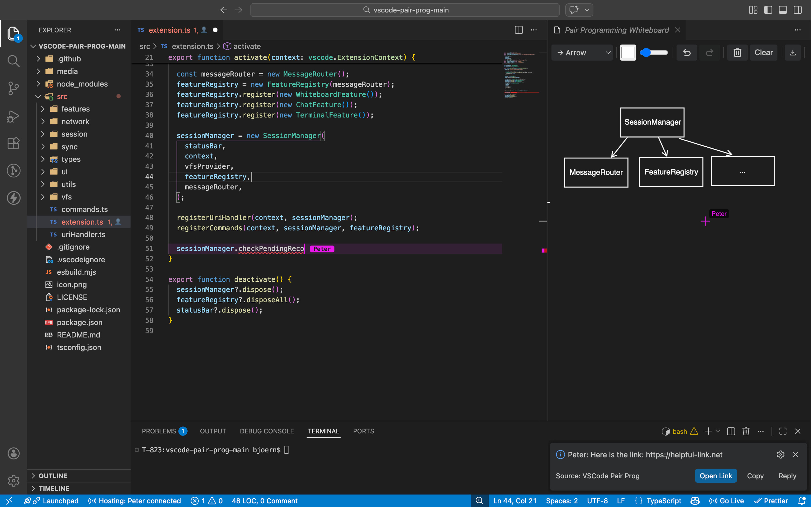

# vscode-pair-prog

Real-time peer-to-peer pair programming on a shared workspace.



## Features

- **Real-Time Collaborative Editing** - Conflict-free simultaneous editing via Operational Transform, including file create/delete/rename sync
- **Cursor & Selection Sync** - See your partner's cursor, selections, and active line
- **Follow Mode** - Automatically follow your partner's cursor across files
- **Jump to Partner** - Instantly jump to your partner's current location
- **Chat** - Quick messaging with copy, reply, and open-link actions
- **Collaborative Whiteboard** - Shared canvas with pen, shapes, arrows, text, undo/redo, zoom/pan, and save as PNG
- **Terminal Sharing** - Host streams terminal output to the client as a read-only remote terminal
- **Edit Access Control** - Client connects read-only by default; host can grant edit access
- **Session Discovery** - Auto-discovers sessions on LAN, plus manual address entry and invite links
- **Passphrase Protection** - Optionally protect sessions with a passphrase
- **Virtual Filesystem** - Client views files in-memory with no local disk writes

## Quick Start

### Host a Session

1. Open a workspace (e.g., a git repo)
2. Run command: **PairProg: Start Hosting Session** (`Ctrl+Shift+P`)
3. Optionally set a passphrase to protect the session
4. Copy the **invite link** or the displayed address (e.g., `192.168.1.5:9876`)
5. Share the invite link or address with your partner

### Join a Session

There are two ways to join a session:

**Via Invite Link:**
1. Click the invite link shared by the host - it opens VS Code and connects automatically
2. Enter the passphrase if the session is protected
3. You're connected!

**Manually:**
1. Open VSCode
2. Run command: **PairProg: Join Session**
3. The extension scans your LAN for active sessions - select a discovered session or enter the host's address manually (e.g., `192.168.1.5:9876`)
4. Enter the passphrase if the session is protected
5. You're connected - edits sync in real-time. Wohooo!

### Invite Links

When you start hosting, the extension generates an invite link. You can:

- **Copy it from the notification** shown when the session starts
- **Copy it from the status bar menu** at any time during the session

## How It Works

```
┌──────────────┐     WebSocket (LAN)     ┌──────────────┐
│     HOST     │<----------------------->│    CLIENT    │
│              │                         │              │
│  Source of   │  <-- ShareDB OT  ---->  │  Edits sync  │
│  truth for   │  -- CursorUpdate <--->  │  via OT in   │
│  all files   │  -- ChatMessage  <--->  │  real-time   │
│              │  -- FileCreated ----->  │              │
│  Files saved │  -- FileDeleted ----->  │              │
│  to disk     │  -- FileRenamed ----->  │  No disk     │
│  HERE only   │  <-- FileSaveRequest    │  writes for  │
│              │  -- FileSaved  ------>  │  text edits  │
└──────────────┘                         └──────────────┘
```

## Configuration

| Setting                   | Default       | Description                          |
|---------------------------|---------------|--------------------------------------|
| `pairprog.port`             | `9876`        | WebSocket server port                |
| `pairprog.username`         | OS username   | Your display name                    |
| `pairprog.highlightColor`   | `#ec15ef`     | Remote partner's cursor color        |
| `pairprog.ignoredPatterns`  | see below     | Glob patterns to exclude from sync   |

Default ignored patterns:
```json
["**/node_modules/**", "**/.git/**", "*.lock", "**/out/**", "**/dist/**", "**/Library/**", "**/vendor/**"]
```

## Commands

| Command                            | Keybinding                          | Description                                                      |
|------------------------------------|-------------------------------------|------------------------------------------------------------------|
| `PairProg: Start Hosting Session`  |                                     | Start a WebSocket server and accept connections                  |
| `PairProg: Stop Hosting Session`   |                                     | Stop hosting and disconnect                                      |
| `PairProg: Join Session`           |                                     | Connect to a host (via invite link, LAN discovery, or address)   |
| `PairProg: Leave Session`          |                                     | Disconnect from host                                             |
| `PairProg: Toggle Follow Mode`     |                                     | Follow your partner's cursor across files                        |
| `PairProg: Jump to Partner`        | `Ctrl+Shift+J` / `Cmd+Shift+J`     | Jump to your partner's current cursor location                   |
| `PairProg: Open Whiteboard`        | `Ctrl+Shift+W` / `Cmd+Shift+W`     | Open a collaborative whiteboard for sketching                    |
| `PairProg: Send Message`           | `Ctrl+Shift+M` / `Cmd+Shift+M`     | Send a chat message                                              |
| `PairProg: Share Terminal`         |                                     | Stream your terminal output to the client (host only)            |
| `PairProg: Stop Sharing Terminal`  |                                     | Stop streaming terminal output (host only)                       |
| `PairProg: Grant Edit Access`      |                                     | Grant the client permission to edit files (host only)            |
| `PairProg: About`                  |                                     | Show the about panel                                             |

Click the status bar item for a quick-pick menu with these options.

## Development

### Setup

```bash
cd vscode-pair-prog
npm install
npm run compile
```

### Debug / Run

1. Open this folder in VS Code
2. Press **F5** to launch the Extension Dev Host
3. In the new VS Code window, open a workspace folder


### Packaging

```bash
npm install -g @vscode/vsce
vsce package
```

This produces a `.vsix` file you can install in VS Code via:
**Extensions -> ⋯ -> Install from VSIX...**
